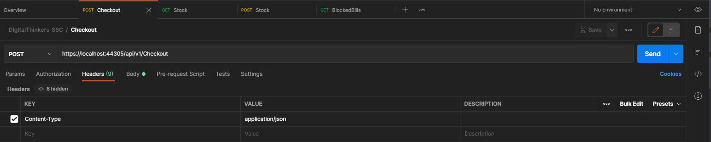
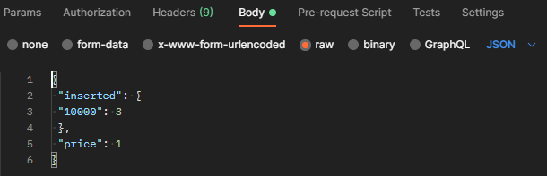

# DigitalThinkers_SSC

DigitalThinkers_SSC is a .NET test exercise. The application simulates a self-checkout machine in a supermarket, which can be restocked,
and calculates which bills and coins should it give back as change when used. It stores the currently available currency in memory.

## Usage
>Target framework: .NET 5.0

First you need to set the starting point to IIS Express. The application won't open a browser. For sending and receiving the HTTP requests I recommend using [Postman](https://www.postman.com/). The IIS Express will allow the application to listen to these post and get requests on https://localhost:44305:

### Postman



### PostStock
> The PostStock endpoint accepts a JSON in a POST request, with an object containing the bills and coins to be
loaded into the “machine” (HUF)

```bash
POST /api/v1/PostStock
```
Example usage of the PostStock endpoint:
```json
POST /api/v1/PostStock
{
 "inserted": {
 "1000": 3,
 "500": 1
 }
}
```
### Getstock 
> The Getstock endpoint returns a 200 OK response, with the currently stored items in the response body.

```bash
GET /api/v1/getstock
```
### Checkout 
> The Checkout endpoint accepts the same object used in the POST request for the Stock endpoint, but this time the
object represents the bills and coins inserted into the machine by the customer during purchase. The JSON
should also contain a price field representing the total price of the purchase.

> The endpoint returns with:
>> 200 OK response, and an object containing the change given back by the machine
>
>> 400 Bad Request response, with a response body describing the error if the purchase cannot be
fulfilled for some reason.


```bash
POST /api/v1/Checkout
```
Example usage of the Checkout endpoint:
```json
POST /api/v1/Checkout
{
 "inserted": {
 "1000": 3,
 "500": 1
 },
 "price": 3200
}
```
```json
Response: 200 OK
{
 "200": 1,
 "100": 1
}
```
### BlockedBills
> The BlockedBills endpoint returns with an array containing the
denominations the machine currently accepts. A bill or coin cannot be accepted if the machine would not be
able to give back proper change

```bash
GET /api/v1/BlockedBills
```
